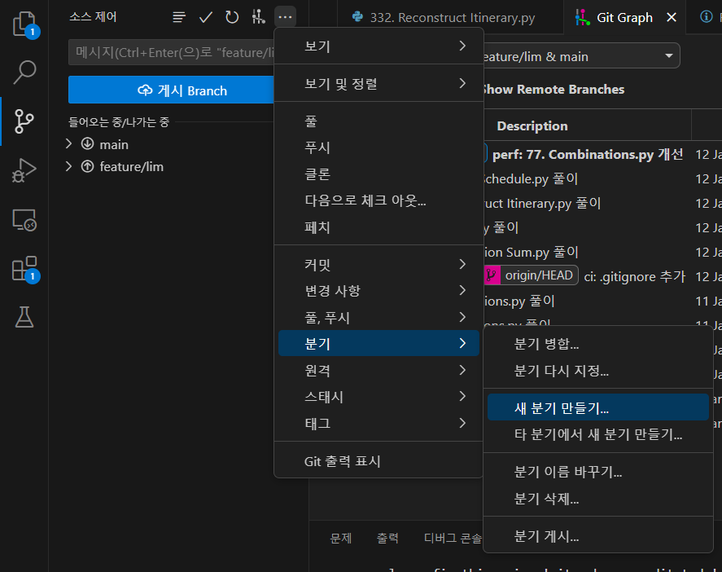
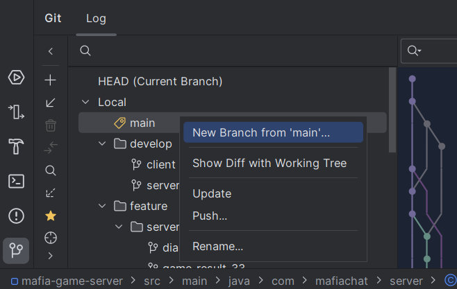
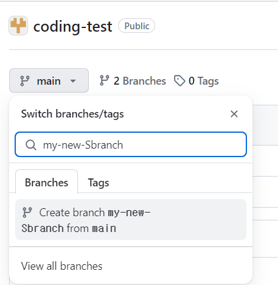
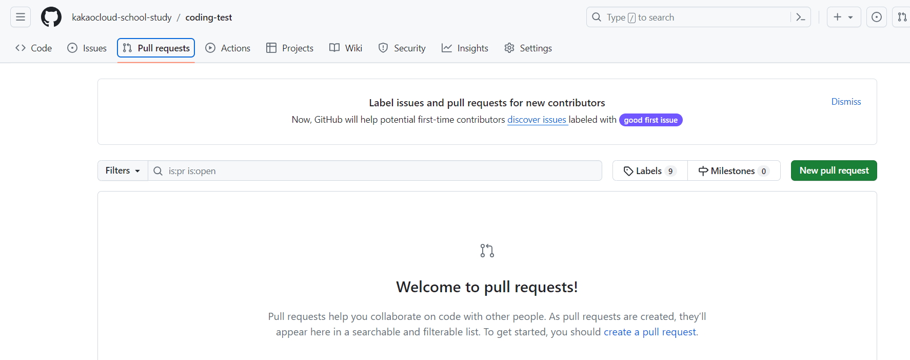
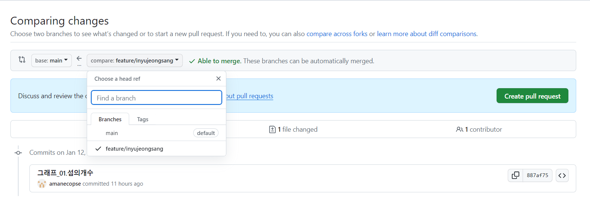

# coding-test
## 1. 진행
### 모임 시간
- 월요일 18시
### 모임 진행
1. 질의 응답 시간.
2. 서로 고른 문제를 사다리타기로 1문제 골라 풀이 시간을 가진다.
3. 풀이한 문제에 대해 토의한다.
### 주간 과제
- 월요일에 공유한 문제들을 금요일까지 해당 레포에 올린다.
- 금요일까지 올려진 서로의 문제를 보고 질의응답을 준비한다.
- 각자 그 주 주제에 맞는 실버 수준 백준, 프로그래머스 문제를 선정한다.
## 2. 브랜치 & 머지 가이드
PR을 통해 코드 리뷰 하길 원한다면 동일 레포에서 브랜치 분기하여 PR을 생성하거나 Fork하여 다른 원격 레포에서 작업한 뒤 cross 레포 PR을 생성하여 진행할 수 있다.
### 브랜치 분기
- CLI: 분기하기 원하는 브랜치에서 ``` git checkout -b [새 브랜치 이름] ```
- IDE (VSCODE): 
- IDE (Intellij): 
- Github: 
### 풀 리퀘스트
- New pull request:

- Comparing changes: 변경 사항을 적용할 base 브랜치와 변경 사항이 존재하는 compare 브랜치를 선택. auto merge가 가능하면 옆에 초록색 글자로 표시된다. 불가능 하다고 경고가 나온다면 미리 자신의 브랜치에서 base 브랜치의 내용을 끌고와 충돌을 해결한 뒤 PR을 올리길 권장.

### 코드리뷰
풀 리퀘스트를 작성하면 리뷰어를 지정하여 리뷰 요청을 하고 리뷰어들은 코드 리뷰를 하여 변경 사항에 대해 코멘트를 남길 수 있다.
## 3. Git 주의 사항
### .gitignore 최신화하기
- 빌드 파일이나 IDE 관련 설정 파일이 tracking 되지 않도록 항상 커밋 전 변경 사항 내역에 신경쓰고 커밋한다.
- 자신의 로컬 내에 빌드 파일이나 IDE 관련 설정 파일이 .gitignore에 추가되어 있지 않다면 그때마다 항상 추가한다.
### 개인 작업 브랜치 외에 변경 금지
- main에 양해 없이 force push 금지. (현재는 ruleset에 막아 놓음)
- 변경 사항 커밋이나 rebase, reset, merge, revert 전 항상 working branch를 확인하여 의도치 않은 브랜치를 변경하지 않도록 주의.